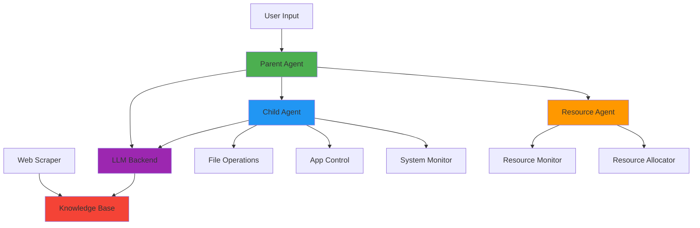
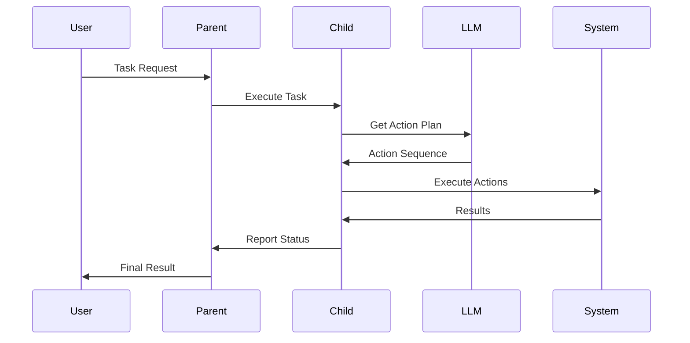
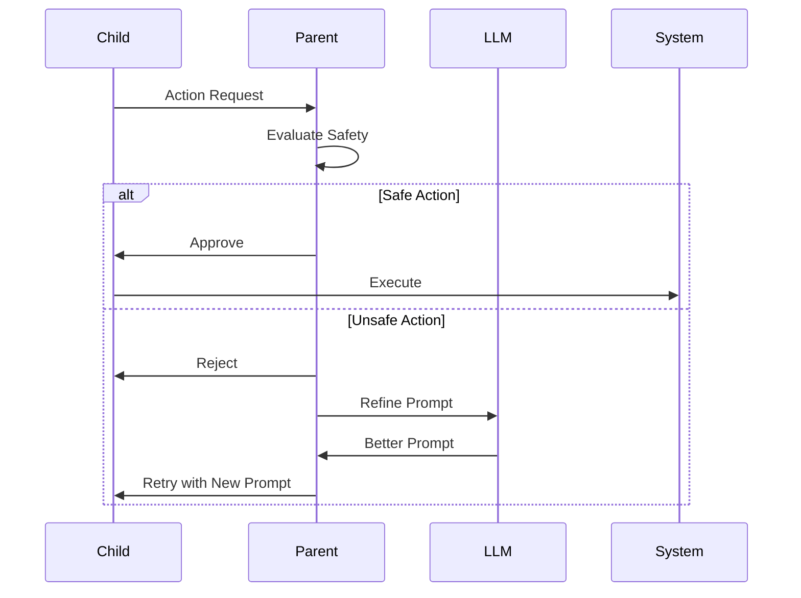
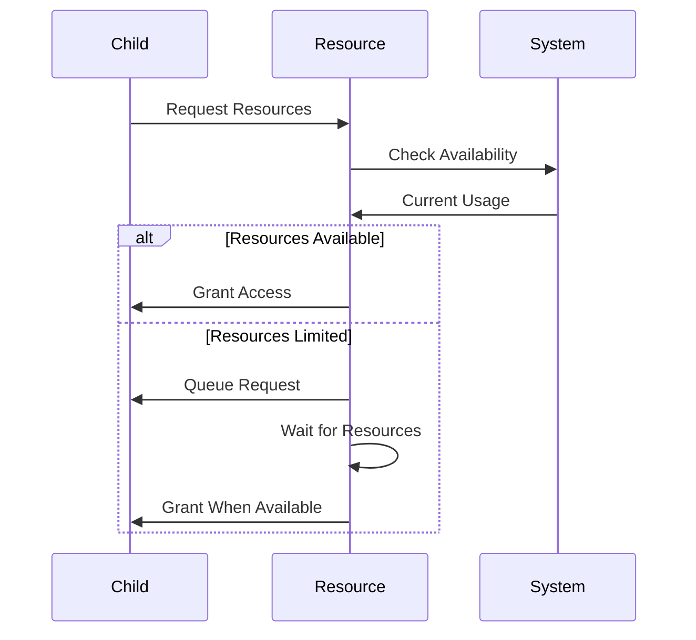
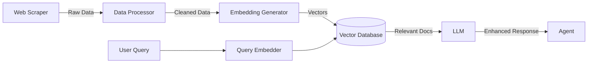
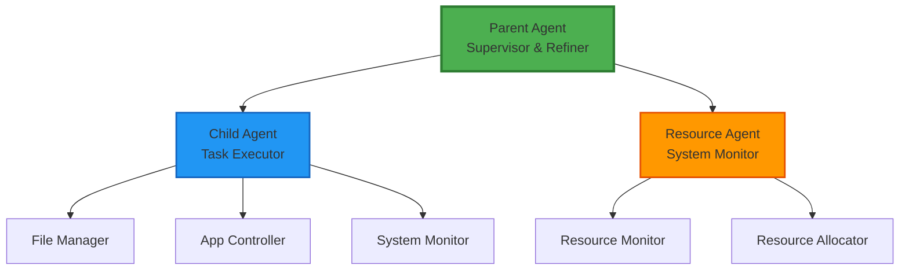
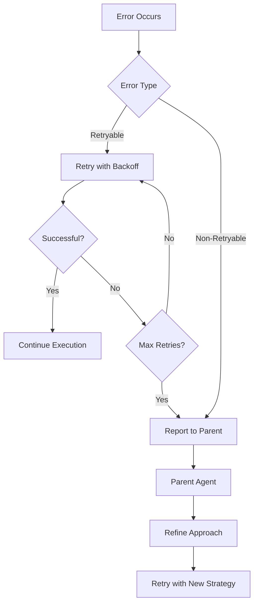

# MAY Project - Architecture Overview

## System Architecture

## Component Interactions

### 1. Child Agent → LLM → Actions

### 2. Parent Agent Supervision

### 3. Resource Management

## Data Flow

### Knowledge Base Integration

## Agent Hierarchy

## Technology Stack

### Core Technologies
- **Language**: Python 3.10+
- **Async Framework**: asyncio
- **Configuration**: Pydantic + YAML
- **Logging**: Loguru

### LLM Integration
- **Providers**: OpenAI, Anthropic
- **Framework**: LangChain
- **Function Calling**: Native API support

### Data & Storage
- **Vector Database**: ChromaDB
- **Embeddings**: sentence-transformers
- **Configuration**: YAML + .env

### System Operations
- **Process Management**: psutil
- **Automation**: pyautogui
- **Window Control**: pygetwindow

### Web Scraping
- **Static Content**: BeautifulSoup
- **Dynamic Content**: Playwright
- **HTTP Client**: httpx

## Security Model

### Safety Layers

1. **Path Validation**
   - Whitelist allowed directories
   - Blacklist system directories
   - Validate file extensions

2. **Permission Checks**
   - Verify user permissions
   - Check file/directory access
   - Validate operation type

3. **Resource Limits**
   - CPU usage caps
   - Memory allocation limits
   - Disk space checks
   - Network bandwidth limits

4. **Action Approval**
   - Parent agent oversight
   - User confirmation for critical actions
   - Audit logging

## Scalability Considerations

### Current Design (Phase 1-8)
- Single machine deployment
- Local LLM or API-based
- File-based configuration
- In-memory state management

### Future Enhancements
- Distributed agent deployment
- Centralized configuration service
- Database-backed state
- Load balancing
- Horizontal scaling

## Monitoring & Observability

### Metrics Collected
- Agent performance (success rate, latency)
- Resource utilization (CPU, memory, disk)
- LLM usage (tokens, cost, latency)
- Action execution (count, duration, errors)

### Logging Strategy
- Structured JSON logs
- Log levels per component
- Rotation and retention
- Centralized log aggregation (future)

## Error Handling

### Error Recovery Strategy

## Development Phases

| Phase | Component | Duration | Status |
|-------|-----------|----------|--------|
| 1 | Foundation & Setup | Week 1 | ✅ Complete |
| 2 | Child Agent | Week 2-3 | 🔄 Next |
| 3 | LLM Integration | Week 4-5 | ⏳ Pending |
| 4 | Parent Agent | Week 6-8 | ⏳ Pending |
| 5 | Resource Agent | Week 9-10 | ⏳ Pending |
| 6 | Web Scraping & KB | Week 11-12 | ⏳ Pending |
| 7 | Integration | Week 13-14 | ⏳ Pending |
| 8 | Documentation | Week 15-16 | ⏳ Pending |

---

**Last Updated**: November 29, 2025  
**Version**: 0.1.0  
**Status**: Phase 1 Complete
